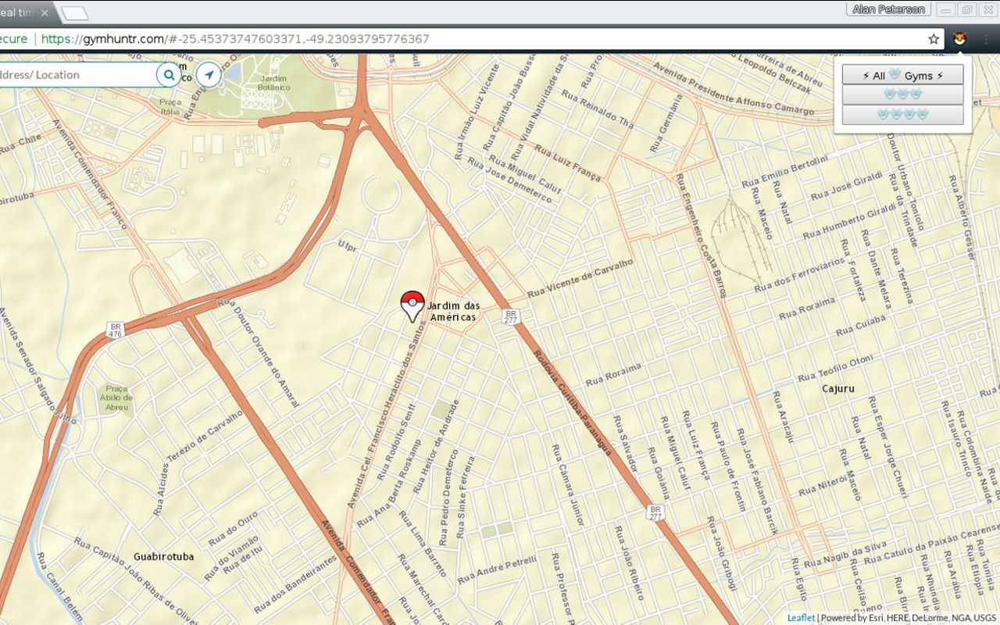
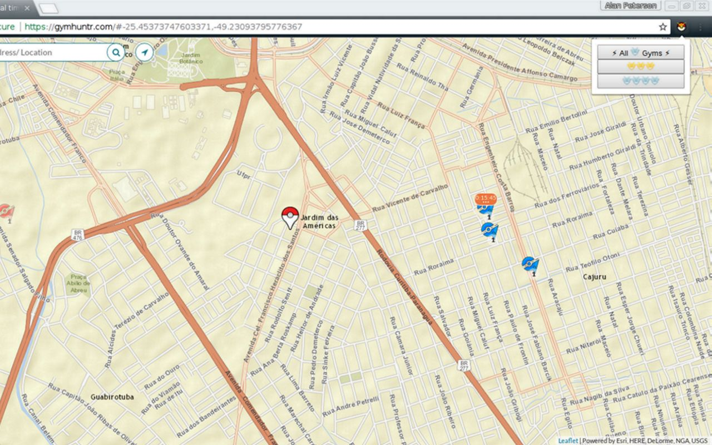

# GymhuntrRaids

A simple Chrome Extension that adds a panel with buttons that hide/show gyms within Gymhuntr.com according to their raid levels.

## Examples
Here are some screenshot of the extension running.

### Todo

* Add filter by Raid Boss name

## Contributing

1. Fork it ( https://github.com/DemonKart/GymhuntrRaids/fork )
2. Create your feature branch (git checkout -b my-new-feature)
3. Commit your changes (git commit -am 'Add some feature')
4. Push to the branch (git push origin my-new-feature)
5. Create a new Pull Request
